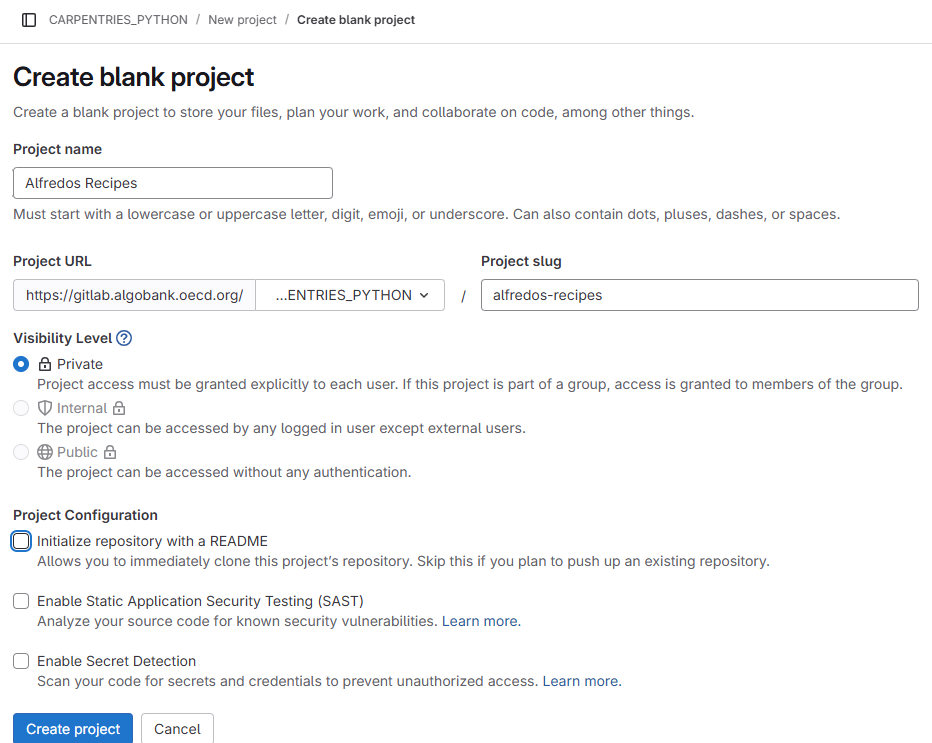
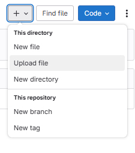

::::::::::::::::::::::::::::::::::::::: objectives

- Explain what remote repositories are and why they are useful.
- Push to or pull from a remote repository.

::::::::::::::::::::::::::::::::::::::::::::::::::

:::::::::::::::::::::::::::::::::::::::: questions

- How do I share my changes with others on the web?

::::::::::::::::::::::::::::::::::::::::::::::::::

Version control really comes into its own when we begin to collaborate with
other people. We already have most of the machinery we need to do this; the
only thing missing is to copy changes from one repository to another.

Systems like Git allow us to move work between any two repositories.  In
practice, though, it's easiest to use one copy as a central hub, and to keep it
on the web rather than on someone's laptop. Most programmers use hosting
services like [GitHub](https://github.com), [Bitbucket](https://bitbucket.org) or
[GitLab](https://gitlab.com/) to hold those main copies; we'll explore the pros
and cons of this in a [later episode](13-hosting.md), but will be using the [OECD Algobank](https://gitlab.algobank.oecd.org/) for this lesson

Let's start by sharing the changes we've made to our current project with the
world. To this end we are going to create a *remote* repository that will be linked to our *local* repository.

## 1\. Create a remote repository

Sign in to the [OECD Algobank](https://gitlab.algobank.oecd.org/), navigate to the [CARPENTRIES_PYTHON] group and create your own project in the group using the `New project`
button:

{alt='The first step in creating a project on GitLab: clicking the "create new" button'}

Next you will have to choice of three different options for creating a project: `Create blank project`, `Create from template` and `Import project`. Create a blank project and use a project name containing your name to create an individual project, e.g. `alfredos-recipes`
Name your repository "recipes" and then click "Create Repository".

Note: Since this repository will be connected to a local repository, it needs to be empty. Uncheck "Initialize repository with a README".

{alt='The second step in creating an Algobank project: filling out the new repository form to provide the individual repository name, and specify that a readme should not be created'}

As soon as the repository is created the Algobank displays a page with a URL and some
information on how to configure your local repository:

{alt='The summary page displayed by the Algobank after a new repository has been created. It contains instructions for configuring the new repository as a git remote'}

This effectively does the following on the Algobank server:

```bash
$ mkdir recipes
$ cd recipes
$ git init
```

If you remember back to the earlier [episode](04-changes.md) where we added and
committed our earlier work on `guacamole.md`, we had a diagram of the local repository
which looked like this:

{alt='A diagram showing how "git add" registers changes in the staging area, while "git commit" moves changes from the staging area to the repository'}

Now that we have two repositories, we need a diagram like this:

{alt='A diagram illustrating how the GitHub "recipes" repository is also a git repository like our local repository, but that it is currently empty'}

Note that our local repository still contains our earlier work on `guacamole.md`, but the
remote repository on GitHub appears empty as it doesn't contain any files yet.

## 2\. Connect local to remote repository

Now we connect the two repositories.  We do this by making the
GitHub repository a [remote](../learners/reference.md#remote) for the local repository.
The home page of the repository includes the URL string we need to
identify it:

{alt='A screenshot showing the https url of the repository'}


Copy that URL from the browser, go into the local `recipes` repository, and run
this command:

```bash
$ git remote add origin https://gitlab.algobank.oecd.org/CARPENTRIES_PYTHON/alfredos_recipes.git
```

Make sure to use the URL for your repository rather than Alfredo's: the only
difference should be your username instead of `alfredos`.

`origin` is a local name used to refer to the remote repository. It could be called
anything, but `origin` is a convention that is often used by default in git
and git servers, so it's helpful to stick with this unless there's a reason not to.

We can check that the command has worked by running `git remote -v`:

```bash
$ git remote -v
```

```output
origin   https://gitlab.algobank.oecd.org/CARPENTRIES_PYTHON/alfredos_recipes.git (fetch)
origin   https://gitlab.algobank.oecd.org/CARPENTRIES_PYTHON/alfredos_recipes.git (push)
```

We'll discuss remotes in more detail in the next episode, while
talking about how they might be used for collaboration.

## 3\. HTTPS Authentication Setup

Before Alfredo can connect to a remote repository, he needs to set up a way for his computer to authenticate with the Algobank so it knows it's him trying to connect to his remote repository. For security resons, thes requires another password than the OECD credentials. The password will be linked to specific scope of permissions Alfredos account has and is therefore called `Personal access token`, short `PAT`.

Now, going to gitlab.algobank.oecd.org, click on your profile icon in the top left corner to get the drop-down menu. 

{alt="Open the user preferences menu by clicking on your avatar and selecting 'preferences'"}

Click "Preferences", then on the
preferences page, click "Personal access tokens". Click the "Add new token" button on the top right. Now,
you can add the token name. Alfredo uses `git_token` since he is going to use the token with `git` and adds a description to it with some details: `Token to push and pull from Algobank repositories`.

He sets the expiration date for in a year, since he plans to work on Algobank projects for at least that time. He grants `read_repository` and `write_repository` scopes to the PAT.

{alt="Create a personal access token with read_repository and write_repository scope"}

Click on `Create token` for the token to be generated. For security reasons this page will only be displayed once, so use the `copy token` button to put the token in your clipboard and save the token in your password manager of choice.

## 4\. Push local changes to a remote

Now that authentication is setup, we can return to the remote.  This command will push the changes from
our local repository to the repository on GitHub:

```bash
$ git push origin main
```

This will open a dialog and prompt for Alfredos credentials. He uses his email address associated with his account (alfredo.linguini@oecd.org) and the PAT he just created. Depending on the default system setting, the prompt can appear directly in the terminal or in a pop-up window:

{alt="Prompt windows for git credentials"}


After confirming the credentials the upload process of git will report back th following:


```output
Enumerating objects: 16, done.
Counting objects: 100% (16/16), done.
Delta compression using up to 8 threads.
Compressing objects: 100% (11/11), done.
Writing objects: 100% (16/16), 1.45 KiB | 372.00 KiB/s, done.
Total 16 (delta 2), reused 0 (delta 0)
remote: Resolving deltas: 100% (2/2), done.
To https://gitlab.algobank.oecd.org/CARPENTRIES_PYTHON/alfredos_recipes.git
 * [new branch]      main -> main
```

:::::::::::::::::::::::::::::::::::::::::  callout

## Password Managers

If your operating system has a password manager configured, `git push` will
try to use it when it needs your username and password.  For example, this
is the default behavior for Git Bash on Windows.

If git is not already configured to cache your credentials you can set a timewindow for caching them to 1 day via 

```bash
# Cache for 1 day
git config --global credential.helper "cache --timeout=86400"
```

Note that the time is set in _minutes_, here 86400 indicates the number of seconds in a day (60 x 60 x 24) seconds.

::::::::::::::::::::::::::::::::::::::::::::::::::

Our local and remote repositories are now in this state:

{alt='A diagram showing how "git push origin" will push changes from the local repository to the remote, making the remote repository an exact copy of the local repository.'}

:::::::::::::::::::::::::::::::::::::::::  callout

## The '-u' Flag

You may see a `-u` option used with `git push` in some documentation.  This
option is synonymous with the `--set-upstream-to` option for the `git branch`
command, and is used to associate the current branch with a remote branch so
that the `git pull` command can be used without any arguments. To do this,
simply use `git push -u origin main` once the remote has been set up.


::::::::::::::::::::::::::::::::::::::::::::::::::

We can pull changes from the remote repository to the local one as well:

```bash
$ git pull origin main
```

```output
From https://gitlab.algobank.oecd.org/CARPENTRIES_PYTHON/alfredos_recipes.git
 * branch            main     -> FETCH_HEAD
Already up-to-date.
```

Pulling has no effect in this case because the two repositories are already
synchronized.  If someone else had pushed some changes to the repository on
GitHub, though, this command would download them to our local repository.

:::::::::::::::::::::::::::::::::::::::  challenge

## Algobank webinterface

Browse to your `Alfredos_recipes` repository on the Algobank.
Click on the `History` button to get the list of commits.
What information can you gather/explore from here?
How would you get that same information in the shell?

:::::::::::::::  solution

## Solution

The list of commits permits to view all details of each commit accessible via `git log` in the local repository.

By clicking on a commits you will see details of the selected commit.
In the list view you can copy the commit identifier using the _duplicate_ button on the right. 

The right-most button lets you view all of the files in the repository at the time of that
commit. To do this in the shell, we'd need to checkout the repository at that particular time.
We can do this with `git checkout ID` where ID is the identifier of the commit we want to
look at. If we do this, we need to remember to put the repository back to the right state
afterwards!


:::::::::::::::::::::::::

::::::::::::::::::::::::::::::::::::::::::::::::::

:::::::::::::::::::::::::::::::::::::::::  callout

## Uploading files directly in Algobank browser

The algobank also allows you to skip the command line and upload files directly to your repository without having to leave the browser. 
You can click the "Upload files" button in the toolbar at the project page. This will open a dialog window to select the file to upload.

{alt="To upload a file click the `+` button at the top of the project page."}


::::::::::::::::::::::::::::::::::::::::::::::::::

:::::::::::::::::::::::::::::::::::::::  challenge

## Git Timestamp

Create a remote repository on the Algobank. Push the contents of your local
repository to the remote. Make changes to your local repository and push these
changes. Go to the repo you just created on the Algobank and check the
[timestamps](../learners/reference.md#timestamp) of the files. How does Git
record times, and why?

:::::::::::::::  solution

## Solution

The Algobank displays timestamps in a human readable relative format (i.e. "22 hours ago" or "three
weeks ago"). However, if you hover over the timestamp, you can see the exact time at which the
last change to the file occurred.


:::::::::::::::::::::::::

::::::::::::::::::::::::::::::::::::::::::::::::::

:::::::::::::::::::::::::::::::::::::::  challenge

## Push vs. Commit

In this episode, we introduced the "git push" command.
How is "git push" different from "git commit"?

:::::::::::::::  solution

## Solution

When we push changes, we're interacting with a remote repository to update it with the changes
we've made locally (often this corresponds to sharing the changes we've made with others).
Commit only updates your local repository.


:::::::::::::::::::::::::

::::::::::::::::::::::::::::::::::::::::::::::::::

:::::::::::::::::::::::::::::::::::::::  challenge

## GitHub License and README files

In this episode we learned about creating a remote repository on the Algobank, but when you initialized
your repo, you didn't add a README.md file. If you had, what do you think
would have happened when you tried to link your local and remote repositories?

:::::::::::::::  solution

## Solution

In this case, we'd see a merge conflict due to unrelated histories. When the Algobank creates a
README.md file, it performs a commit in the remote repository. When you try to pull the remote
repository to your local repository, Git detects that they have histories that do not share a
common origin and refuses to merge.

```bash
$ git pull origin main
```

```output
warning: no common commits
remote: Enumerating objects: 3, done.
remote: Counting objects: 100% (3/3), done.
remote: Total 3 (delta 0), reused 0 (delta 0), pack-reused 0
Unpacking objects: 100% (3/3), done.
From https://gitlab.algobank.oecd.org/CARPENTRIES_PYTHON/alfredos_recipes
 * branch            main     -> FETCH_HEAD
 * [new branch]      main     -> origin/main
fatal: refusing to merge unrelated histories
```

You can force git to merge the two repositories with the option `--allow-unrelated-histories`.
Be careful when you use this option and carefully examine the contents of local and remote
repositories before merging.

```bash
$ git pull --allow-unrelated-histories origin main
```

```output
From https://gitlab.algobank.oecd.org/CARPENTRIES_PYTHON/alfredos_recipes
 * branch            main     -> FETCH_HEAD
Merge made by the 'recursive' strategy.
README.md | 1 +
1 file changed, 1 insertion(+)
create mode 100644 README.md
```

:::::::::::::::::::::::::

::::::::::::::::::::::::::::::::::::::::::::::::::

:::::::::::::::::::::::::::::::::::::::: keypoints

- A local Git repository can be connected to one or more remote repositories.
- Use the HTTPS protocol to connect to remote repositories.
- `git push` copies changes from a local repository to a remote repository.
- `git pull` copies changes from a remote repository to a local repository.

::::::::::::::::::::::::::::::::::::::::::::::::::
